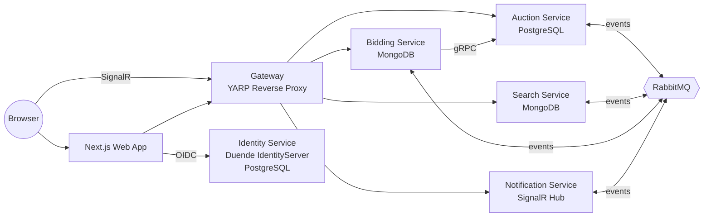

# MAZAD 🔨 — Real-Time Auction Platform

A car auction platform built as **event-driven .NET microservices** with a **Next.js** frontend. Users create auctions, place bids, and see other people's bids appear **live** — no page refresh — via SignalR.

> **Mazad (مزاد)** means *auction* in Arabic.

<!-- Add a screenshot or demo GIF here:

-->

## 🌐 Live Demo (Not Deployed yet)

| | URL |
|---|---|
| **App** | https://app.mazad.duckdns.org |
| API Gateway | https://api.mazad.duckdns.org/search |
| Identity Server | https://id.mazad.duckdns.org |

**Demo accounts** (or register your own): username `alice` or `bob`, password `Pass123$`

> Hosted on an Oracle Cloud Always Free ARM VM — see [DEPLOYMENT.md](DEPLOYMENT.md) for the full setup.

## ▶️ Run It Yourself (one command)

All you need is [Docker](https://www.docker.com/products/docker-desktop/):

```bash
git clone https://github.com/Youssefhikal93/.NET-NEXT---MAZAD.git mazad
cd mazad
docker compose up -d --build
```

Then start the frontend:

```bash
cd frontend/web-app
npm install
npm run dev
```

Open **http://localhost:3000**, log in as `bob` / `Pass123$`, and place a bid. Open a second browser as `alice` and watch the bid arrive live.

> First boot only: if the auction list looks empty, run `docker compose restart search-svc` — the search index syncs from the auction service, which may still be seeding on the very first start.

## 🏗 Architecture

Six independent services communicate asynchronously over RabbitMQ, with gRPC for the one synchronous cross-service call:



| Service | Responsibility | Tech |
|---|---|---|
| **Auction** | Auction lifecycle, source of truth | .NET 9, EF Core, PostgreSQL, gRPC server |
| **Search** | Fast full-text search over auctions | .NET 9, MongoDB, consumes auction events |
| **Bidding** | Bid placement & validation, auction finishing | .NET 9, MongoDB, gRPC client |
| **Notification** | Pushes bids/auctions to browsers in real time | .NET 9, SignalR |
| **Identity** | Authentication & tokens (OIDC) | .NET 8, Duende IdentityServer, ASP.NET Identity |
| **Gateway** | Single public API entry, routing, CORS, authz | .NET 9, YARP |
| **Web App** | UI with SSR and live updates | Next.js 15, React 19, NextAuth, Tailwind, Zustand |

**Patterns demonstrated:** event-driven communication (MassTransit + RabbitMQ), database-per-service (PostgreSQL + MongoDB), API gateway, OIDC auth flow, gRPC, real-time push, outbox-style resilience (messages survive service restarts), containerized multi-arch builds (x64 + ARM64).

## 🧪 Tests

```bash
dotnet test
```

Unit and integration tests for the auction service live in `tests/` (`AuctionService.UnitTests`, `AuctionService.Integrationtest`).

## 🚀 Deployment

The whole system runs on a single free-tier VM behind a Caddy reverse proxy with automatic HTTPS.
See **[DEPLOYMENT.md](DEPLOYMENT.md)** — including multi-arch image builds, DuckDNS setup, and the production compose file.

## 📁 Repository Layout

```
├── src/                  # the six .NET services
├── frontend/web-app/     # Next.js frontend
├── tests/                # unit & integration tests
├── docker-compose.yaml   # local development stack
├── docker-compose.prod.yaml  # production stack (with Caddy TLS)
└── deploy/               # Caddyfile + multi-arch build script
```
